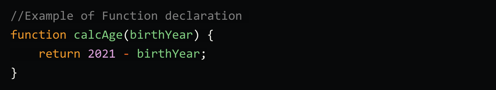
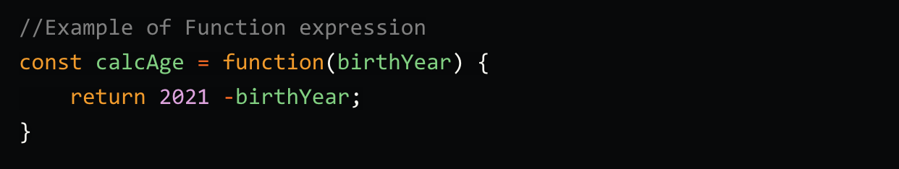
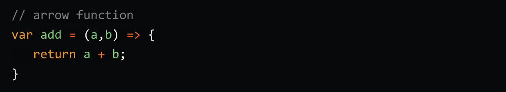
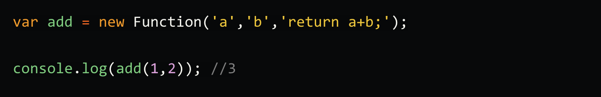

<h1 align="center"> Ways to Group, Categorize & Define JavaScript Functions </h1>

## Function Declaration

Here, the function is defined starting with the function keyword then a name followed by parentheses and then curly braces where your statements will be written.  

## Function Expression

Function expression does not have a name, this is usually called an anonymous function. The value of the function cannot be used until it is stored in a variable.  

## Arrow Function

An arrow function is a cleaner, concise & a compact alternative to a traditional function expression, but is limited and can't be used in all situations. Here is how we write the above function using the Arrow function syntax.

## Function Constructor

you can define your function dynamically using Function() constructor along with the new operator. This is how we can use the Function() constructor to create functions.

## Different Names

### Anonynous Function

### Fart Function

### IIFE

## Concerns

### Arguments

### Scope

### `this` Keyword

### Hoisting

### Function Object
